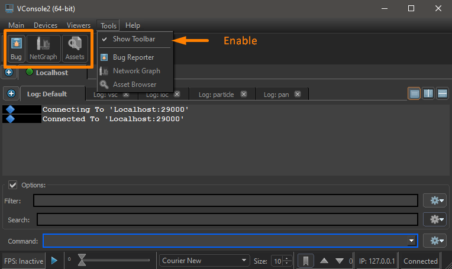
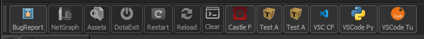
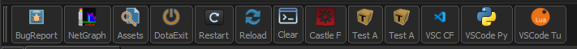

 ## vConsole
Dota2 Tools have a console `vConsole2.exe`
 
 Today I will show you how to change the functionality of the toolbar. In this article, we will not consider the configuration and standard features of the vConsole program.

> Standard toolbar view:



This is the part of the program that we will expand on today.
What opportunities will we get :

1) Button launches a tool from the dll (in default config bug reporter and NetGraph )
1) Button applies a console command (in default config launches AssetBrowser )
1) Button launches an external program (VsCode , Notepade++, Sublime text, and of course Dota2 Tools )

In variant 1 we probably can't change anything (or it would be very difficult and my knowledge is lacking).

But the other two are just right.

We need this configuration file for the console :
`dota 2 beta\game\core\tools\sdk_vconsole_subtools.txt`

The file format is the usual key-value. The key parameters that I was able to find for this file:

```
m_Name                       - Section name - importance is low, no visibility (but better to use).
m_MenuString                 - Name for menu list Tools.
m_SubToolIconPath            - Path for image icon (Button or menu). Great choice here "\dota 2 beta\game\core\tools\images\". You can also shorten the way "game:tools/images/workshopmanager/icon_refresh_activated.png"
m_ToolbarString              - Name for button.
m_StatusBarTipString         - ToolTip in status bar and pop-up tooltip on the button.
m_CommandString              - any/all console commands that you already use in Dota2 Tools, (commands separated by semicolons are executed alternately, as in the console).
m_ExecutablePath             - the path to the executable file. (the slash in the path name, must be escaped with a slash \\)
m_ExecutableArguments        - arguments to run the executable file
m_LibraryPath                - the path to the DLL (for internal Dota tools)
m_AdditionalDependencies     - additional dependencies (probably expand the tools we are not really available)
m_bRequiresAppConnection     - Checking the connection to the application Dota2 (if Dota2 is running the icon takes full color, otherwise the icon is completely in shades of gray and cannot be clicked) 
m_bRequiresToolConnection    - Checking the connection to the application Dota2 Tools (AssetBrowser only in tools, netgraph is also available in Dota2)
m_bInternalUseOnly           - only internal use - the essence is not clear.
m_bAllowAutoStart            - run at console start (not sure if it works in every situation)
m_ToolConfig                 - I don't know what it's for.(Maybe here you can specify the config from PET Hammer and other tools)
m_MaterialSystemDependencies - we are not interested (section with other dependencies - did not notice the difference by editing it)
m_SubTools                   - Our area for customization
// +dota_launch_custom_game  - comments work
```
Many names will speak for themselves.

We are interested in the `m_SubTools` section of this file.

***
## **__Important : DOTA2 may overwrite this file after an update (not always), make sure to make a backup copy (with your edits).__**
***

Examples from my config.
restarting the map with clearing the console :
```
{
    m_Name                      = "Restart" 
    m_MenuString                = "Restart"
    m_SubToolIconPath           = "game:tools/images/workshopmanager/icon_refresh_activated.png"
    m_ToolbarString             = "Restart"
    m_StatusBarTipString        = "Restart map"
    m_CommandString             = "clear;restart"
    m_bRequiresToolConnection   = true
}
```

running Dota2 Tools with the test addon and launch parameters:
```
{
    m_Name                      = "tp"
    m_MenuString                = "Test project"
    m_SubToolIconPath           = "game:tools/images/hammer/toggle_tools_materials_activated.png"
    m_ToolbarString             = "Test A"
    m_StatusBarTipString        = "Test Addon load"
    m_ExecutablePath            = "X:\\Steam\\steamapps\\common\\dota 2 beta\\game\\bin\\win64\\dota2.exe"
    m_ExecutableArguments       = "-nobreakpad 375360 -tools -addon test -novid -uidev -dev -nominidumps -condebug -toconsole -vconsole "
}
```
running a VSCode program with arguments (in this case the workspace is specified):
```
{
    m_Name                      = "vsc"
    m_MenuString                = "VSCode"
    m_SubToolIconPath           = "C:/Microsoft VS Code/resources/app/resources/win32/code_70x70.png"
    m_ToolbarString             = "VSCode XX"
    m_StatusBarTipString        = "Run Vscode Addon XxxXxx"
    m_ExecutablePath            = "X:\\Microsoft VS Code\\Code.exe"
    m_ExecutableArguments       = "X:\\xxxx\\xx_scripts.code-workspace"
}
```

***
View of my toolbar without Dota2 tools running :


with running tools :



I hope my article will help you better organize your workspace when developing addons and you will be able to make more good and interesting projects.
> PS my native languages BY RUS , I apologize for possible translation inaccuracies.
